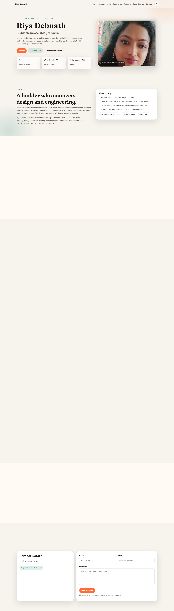
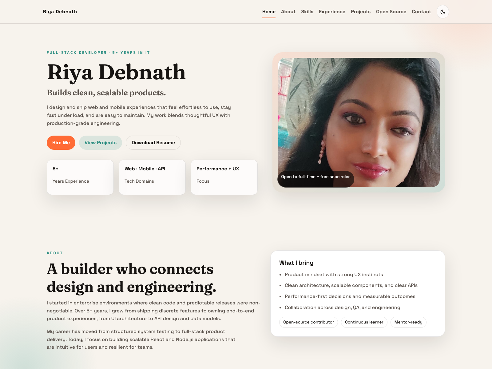
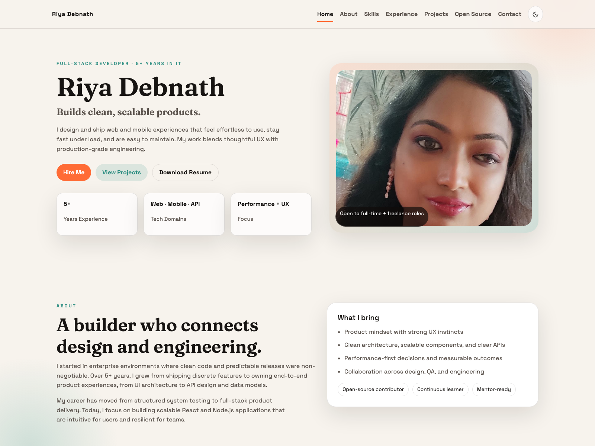
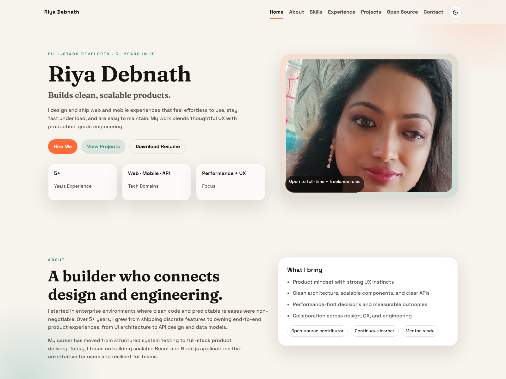
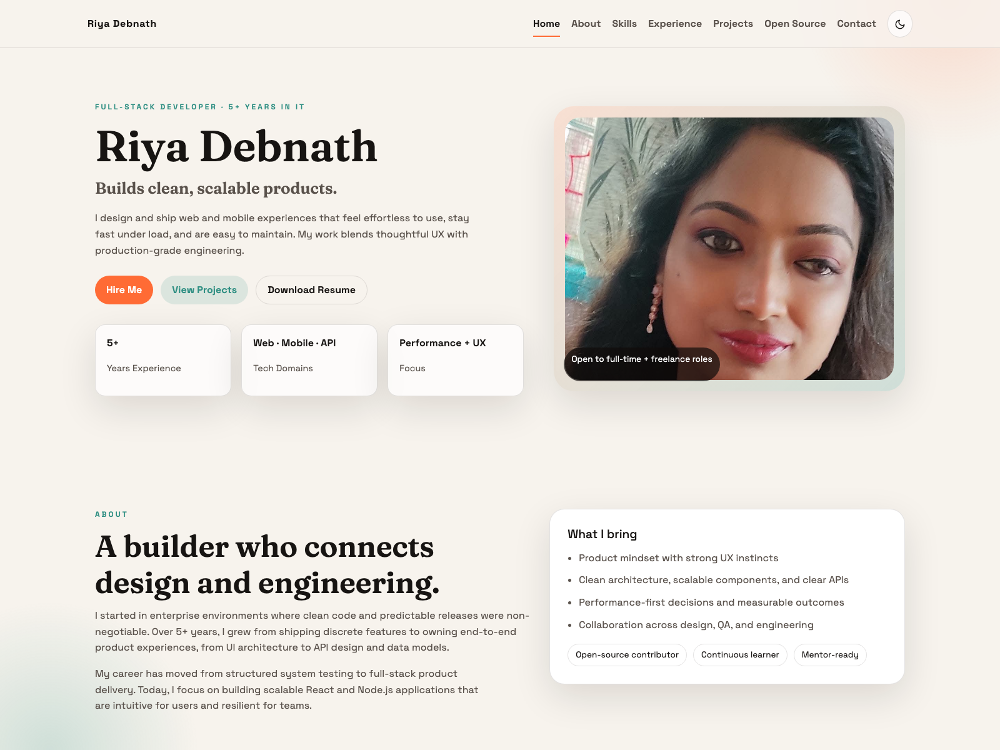
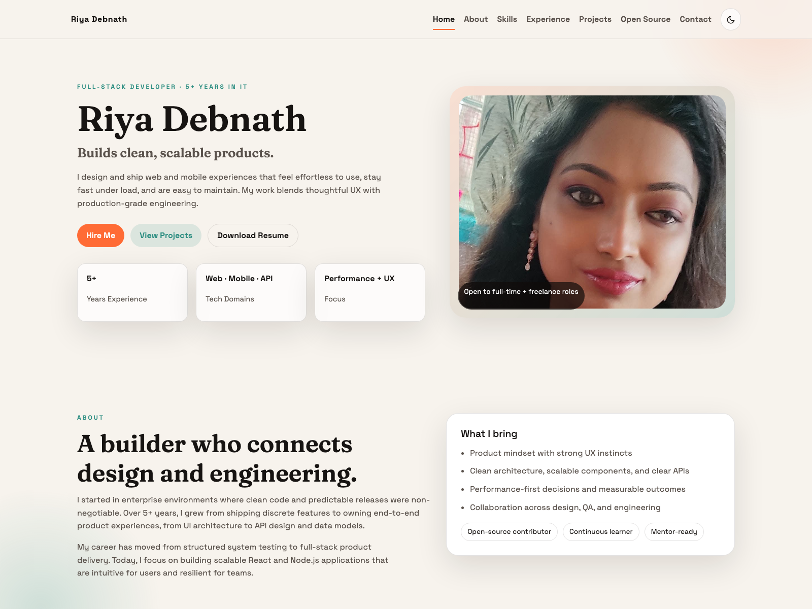
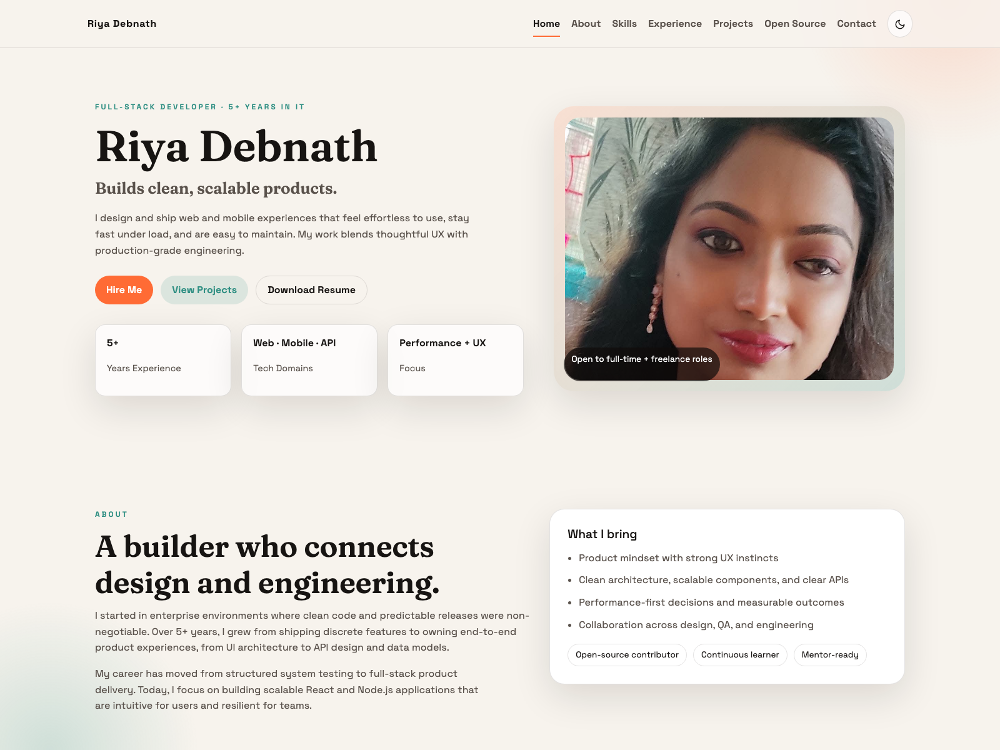

# Riya Debnath Portfolio

Modern, recruiter-ready developer portfolio built with React and a Node/Express backend. The app is a one-page experience with production-style sections, API-backed content, and a contact workflow.

## Features
- Hero section with CTA actions (`Hire Me`, `View Projects`, `Download Resume`)
- About section with strengths and positioning
- Skills section grouped by domain
- Experience timeline
- Project case studies with stack/features/challenges
- Open Source & Learning highlights
- Contact details + contact form submission

## Feature Screenshots

### Full Page


### Hero


### About


### Skills


### Experience


### Projects


### Open Source & Learning


### Contact


## Tech Stack
- React
- React Router
- Framer Motion
- Bootstrap
- Node.js
- Express
- MongoDB + Mongoose

## Local Setup
```bash
cd /Users/riyadebnathdas/Applications/my-portfolio/server
npm install
npm start
```

```bash
cd /Users/riyadebnathdas/Applications/my-portfolio/client
npm install
npm start
```

## API Endpoints
- `GET /api/skills`
- `GET /api/projects`
- `GET /api/contact`
- `POST /api/contact`
